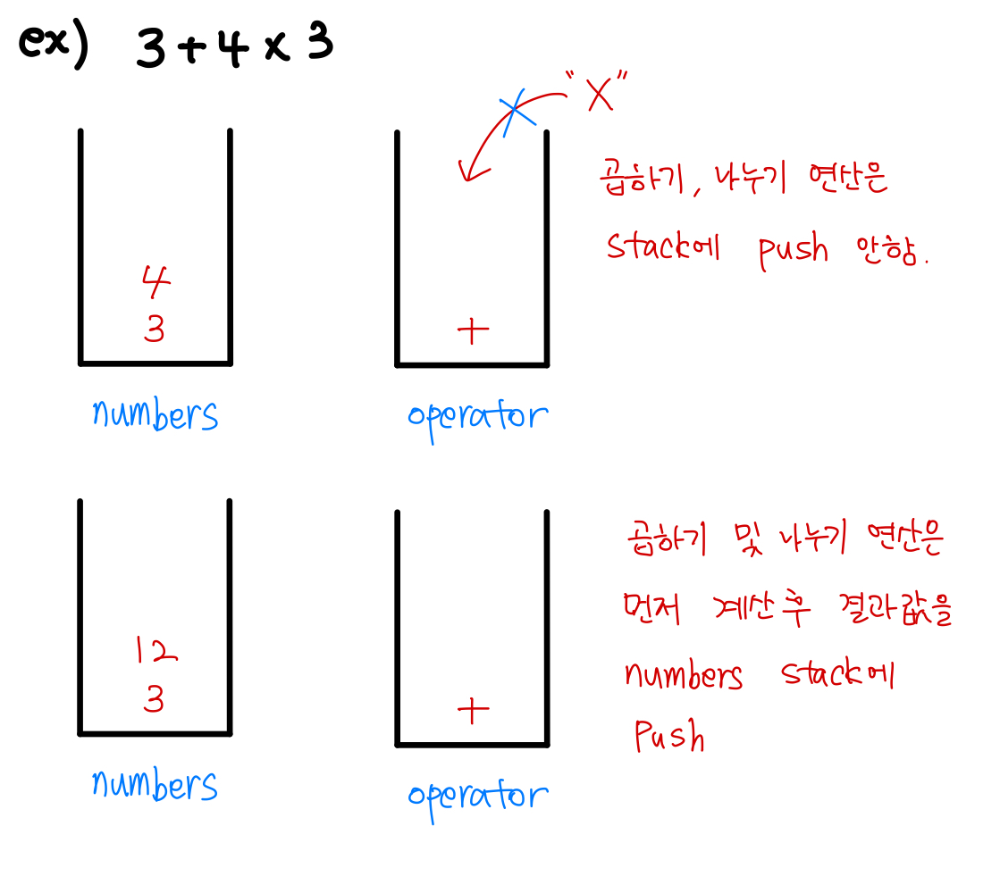

## 깃허브

**[java-calculator](https://github.com/programmers-lecture/java-calculator)**

## 필수 요구사항

1. 입력을 받았을 경우 사칙연산(+, -, *, /)이 가능해야 한다.
2. 피연산자(숫자)의 범위는 Integer로 한정한다.

## 추가 요구사항

1. 숫자에 소수를 적용해본다.
2. 사칙연산 우선순위를 적용한다.
   - *, /와 +, -가 있다면 *, / 가 먼저 진행되어야 한다.

cf) 추가 요구사항은 순서대로 적용해보시고, 필수 요구사항이 모두 구현을 하고 난 이후에 구현해주시길 바랍니다.

## 프로그램 실행 결과

```jsx
1 + 2
결과 : 3

1 - 2 + 5
결과 : 4

3 * 4
결과 : 12

3 + 2 * 3
결과 : 9
```

## 미션 가이드 (학생)

1. ReadMe에 각 객체에 대한 간단한 다이어그램(설명)을 작성한다.
2. ReadMe에 각 요구사항에 대한 체크 리스트를 작성한다.
3. 커밋은 최소한의 단위로 진행한다.
4. 객체지향 생활 체조를 지켜서 개발한다.

   [객체지향 생활 체조 총정리](https://developerfarm.wordpress.com/2012/02/03/object_calisthenics_summary/)

## 간단한 Diagram



## 체크리스트

☑ 입력을 올바르게 받는다.

☑️ 사칙연산이 잘 동작한다.

☑️ 곱하기(*)와 나누기(/)가 더하기(+), 빼기(-)보다 먼저 수행된다.

☑️ 숫자에 소수를 적용시킨다. → Integer를 Double로 바꿔보자!

☑️ Enum을 활용해서 구현해본다.

▢ 잘못된 입력에 대한 검증을 구현한다.

▢ 우선순위 계산과 후순위 계산을 별도의 메서드로 분리해서 구현해본다.
